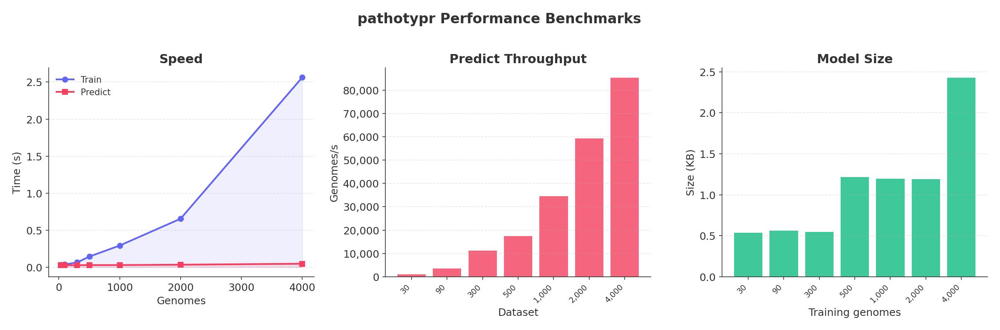
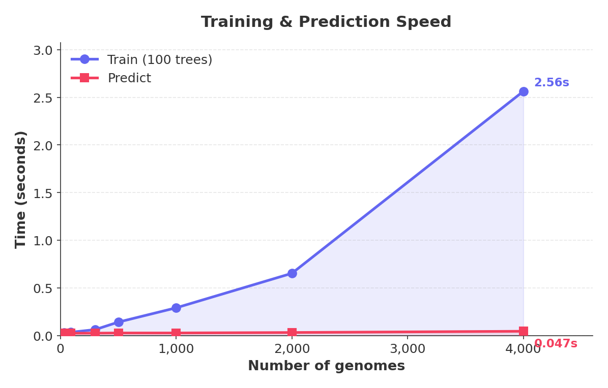
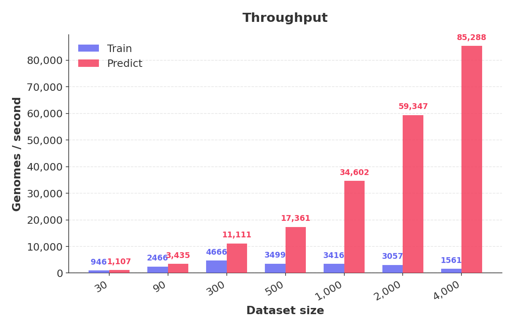
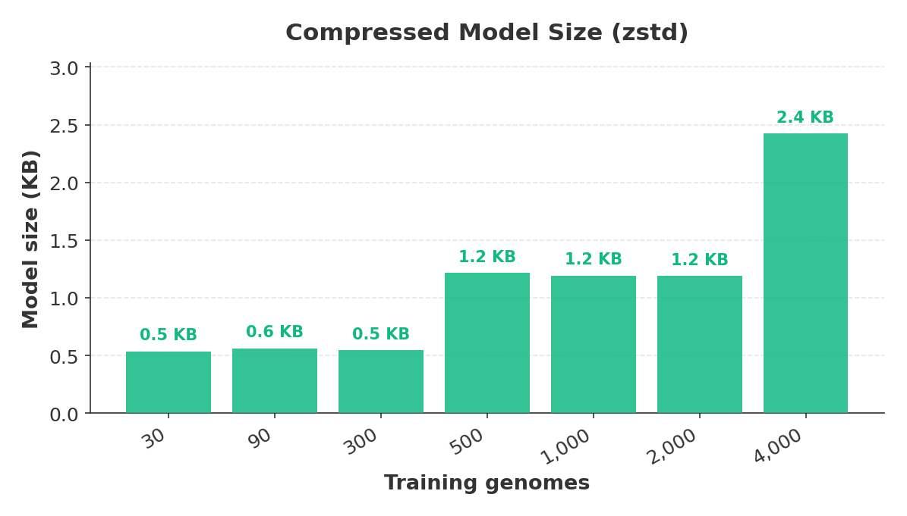
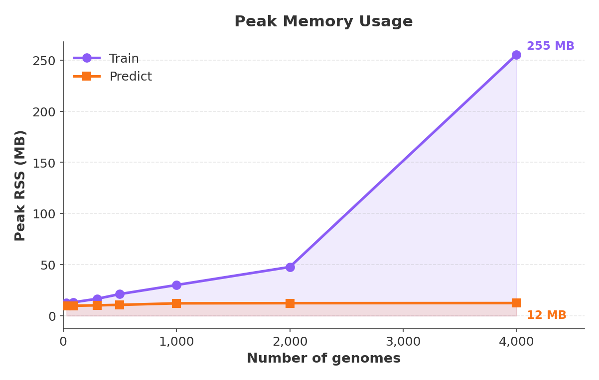
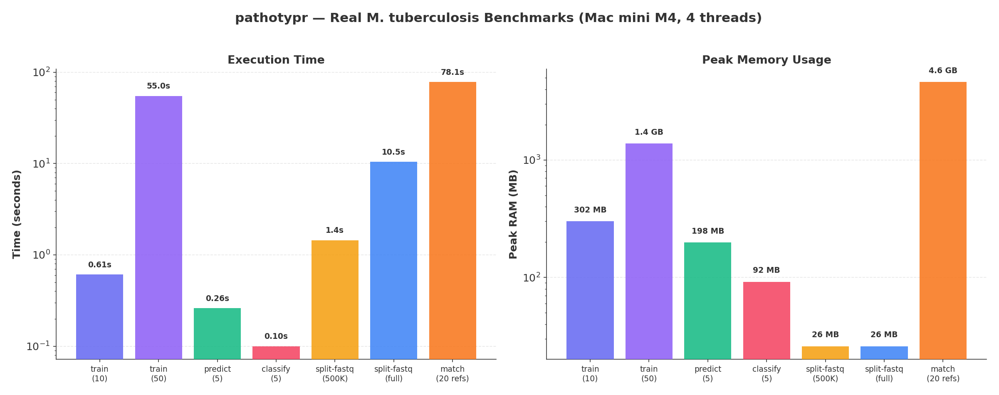
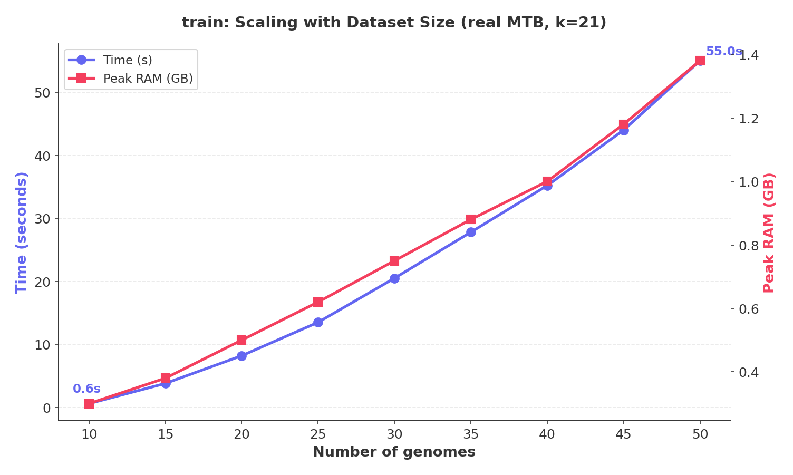
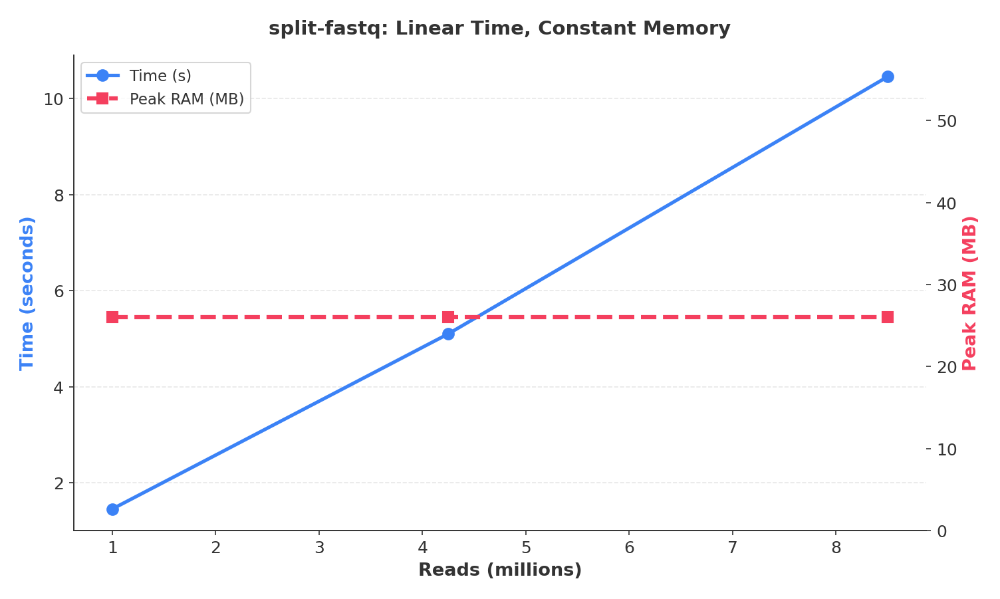
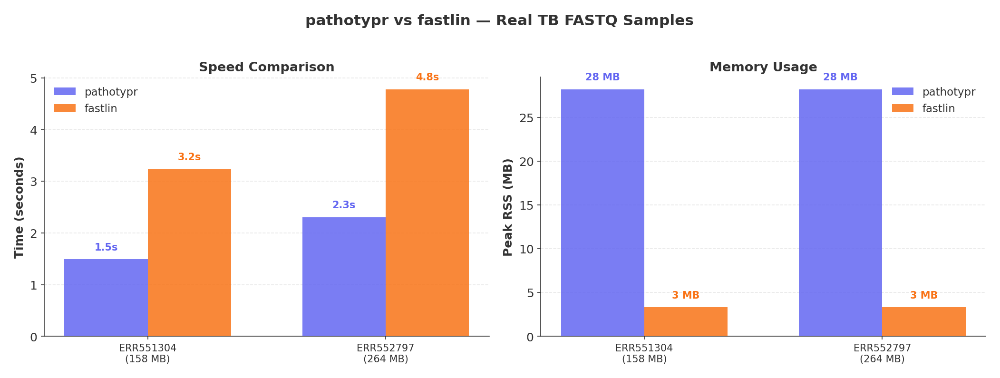

# Performance Benchmarks

Synthetic benchmarks measuring training and prediction speed, throughput, model size, and memory usage across different dataset sizes. All benchmarks run on a Mac mini M4 (4 threads, k=11, 1000 bp synthetic sequences).

> **Reproduce these benchmarks:** `bash benchmarks/run_benchmarks.sh && python3 benchmarks/plot_benchmarks.py`

## Dashboard

  <picture>
    <source media="(prefers-color-scheme: dark)" srcset="../benchmarks/figures/dashboard-dark.png">
    <source media="(prefers-color-scheme: light)" srcset="../benchmarks/figures/dashboard.png">
    
  </picture>

## Training & Prediction Speed

  <picture>
    <source media="(prefers-color-scheme: dark)" srcset="../benchmarks/figures/speed-dark.png">
    <source media="(prefers-color-scheme: light)" srcset="../benchmarks/figures/speed.png">
    
  </picture>

| Genomes | Train time | Predict time | Speedup vs predict |
|---:|---:|---:|---:|
| 30 | 0.032 s | 0.027 s | — |
| 90 | 0.037 s | 0.026 s | — |
| 300 | 0.064 s | 0.027 s | 2.4× |
| 500 | 0.143 s | 0.029 s | 4.9× |
| 1,000 | 0.293 s | 0.029 s | 10.1× |
| 2,000 | 0.654 s | 0.034 s | 19.2× |
| 4,000 | 2.563 s | 0.047 s | 54.5× |

Training scales with dataset size (vectorization + 100 trees). Prediction is nearly constant — streaming batch processing keeps it under 50 ms regardless of input size.

## Throughput

  <picture>
    <source media="(prefers-color-scheme: dark)" srcset="../benchmarks/figures/throughput-dark.png">
    <source media="(prefers-color-scheme: light)" srcset="../benchmarks/figures/throughput.png">
    
  </picture>

Prediction throughput reaches **85,000+ genomes/second** at scale. Training throughput remains above 1,500 genomes/second even at 4,000 samples.

## Model Size

  <picture>
    <source media="(prefers-color-scheme: dark)" srcset="../benchmarks/figures/model_size-dark.png">
    <source media="(prefers-color-scheme: light)" srcset="../benchmarks/figures/model_size.png">
    
  </picture>

Models are compressed with zstd and stay remarkably small — **under 3 KB** for all test configurations. Real-world models with full bacterial genomes (4–6 Mb) are typically 5–50 MB compressed.

## Peak Memory

  <picture>
    <source media="(prefers-color-scheme: dark)" srcset="../benchmarks/figures/memory-dark.png">
    <source media="(prefers-color-scheme: light)" srcset="../benchmarks/figures/memory.png">
    
  </picture>

Memory usage grows linearly with training data but remains modest. Prediction memory is dominated by the model size and stays nearly flat.

## All Modules — Real *M. tuberculosis* Data

End-to-end benchmarks using real MTB genomes (~4.4 Mb each, k=21) on a Mac mini M4 (4 threads).

  <picture>
    <source media="(prefers-color-scheme: dark)" srcset="../benchmarks/figures/all_modules-dark.png">
    <source media="(prefers-color-scheme: light)" srcset="../benchmarks/figures/all_modules.png">
    
  </picture>

### Train

| Genomes | Time | Peak RAM | Model Size |
|---:|---:|---:|---:|
| 10 | **0.6 s** | 302 MB | ~13 KB |
| 50 | **55 s** | 1,381 MB | ~35 KB |

Training time scales with dataset size due to vectorization (4.4M k-mers per genome) and tree construction.

  <picture>
    <source media="(prefers-color-scheme: dark)" srcset="../benchmarks/figures/train_scaling_real-dark.png">
    <source media="(prefers-color-scheme: light)" srcset="../benchmarks/figures/train_scaling_real.png">
    
  </picture>

### Predict

| Genomes | Model source | Time | Peak RAM |
|---:|---|---:|---:|
| 5 | 10-genome model | **0.25 s** | 197 MB |
| 5 | 50-genome model | **0.26 s** | 198 MB |

Prediction is nearly instant (~50 ms/genome), dominated by I/O. Model size has minimal impact on speed.

### Classify (Assembly Markers)

| Genomes | Markers | Time | Peak RAM |
|---:|---:|---:|---:|
| 5 | 3,707 SNPs | **0.10 s** | 92 MB |

Assembly marker calling is extremely fast (~20 ms/genome) — k-mer matching on pre-assembled FASTA.

### Split-FASTQ (Read Genotyping)

| Input | Reads | Time | Peak RAM |
|---|---:|---:|---:|
| 500K PE reads (subsampled) | 1M | **1.5 s** | 26 MB |
| Full ERR2659157 (65× coverage) | ~8.5M | **10.5 s** | 26 MB |

Constant 26 MB memory regardless of input size — Bloom filter + streaming reads. Speed scales linearly with read count.

  <picture>
    <source media="(prefers-color-scheme: dark)" srcset="../benchmarks/figures/split_fastq_scaling-dark.png">
    <source media="(prefers-color-scheme: light)" srcset="../benchmarks/figures/split_fastq_scaling.png">
    
  </picture>

### Match (Reference Matching)

| References | Input | Time | Peak RAM |
|---:|---|---:|---:|
| 20 | 500K PE reads | **78 s** | 4,606 MB |

Match is the most memory-intensive module: each reference batch loads ~4.4 Mb genome + ~34 MB k-mer set. Time and memory scale with reference count × read count.

### Summary

| Module | Time (typical) | Peak RAM | Scales with |
|---|---|---|---|
| **train** | 1–60 s | 300–1400 MB | N genomes × genome size |
| **predict** | 0.25 s | ~200 MB | Input size (streaming) |
| **classify** | 0.1 s | ~90 MB | N genomes × N markers |
| **split-fastq** | 1–11 s | 26 MB (constant) | Read count |
| **match** | 78 s / 20 refs | ~4.6 GB | N references × read count |

---

## pathotypr vs fastlin — Real TB Data

Head-to-head comparison using real *Mycobacterium tuberculosis* FASTQ samples from the European Nucleotide Archive.

  <picture>
    <source media="(prefers-color-scheme: dark)" srcset="../benchmarks/figures/comparison-dark.png">
    <source media="(prefers-color-scheme: light)" srcset="../benchmarks/figures/comparison.png">
    
  </picture>

| Sample | FASTQ size | pathotypr | fastlin | Speedup |
|---|---|---|---|---|
| ERR551304 (L2) | 158 MB | **1.49 s** | 3.23 s | **2.2×** |
| ERR552797 (A4/bovis) | 264 MB | **2.30 s** | 4.78 s | **2.1×** |

| | pathotypr | fastlin |
|---|---|---|
| **Speed** | ~2× faster | — |
| **Peak RAM** | 28 MB | 3 MB |
| **Markers** | Custom (3,707 SNPs) | Built-in barcodes (1,230) |
| **Lineage depth** | Full hierarchy (L2;L2.2) | Sub-lineage (2.2.1) |
| **Organism** | Any (custom markers) | TB only |

Both tools correctly identified the major lineage. pathotypr is consistently ~2× faster due to parallel k-mer scanning with Bloom filter acceleration, while fastlin uses ~10× less memory thanks to its minimal barcode approach.

**Test conditions:** Mac mini M4, 4 threads, paired-end reads, gzip-compressed FASTQ.

## Methodology

- **Hardware**: Mac mini M4, 16 GB RAM
- **Threads**: 4 (fixed for reproducibility)
- **Sequences**: synthetic 1000 bp sequences with class-distinctive k-mer motifs
- **Runs**: 3 per configuration, median reported
- **k-mer size**: 11 (smaller than production default of 21, for speed)
- **Trees**: 100 (production default)
- **Peak RSS**: measured via `/usr/bin/time -l` (macOS)

### Scaling expectations for real data

With real bacterial genomes (~4.4 Mb, k=21):
- Training 500 genomes: ~30–60 seconds
- Prediction 500 genomes: ~2–5 seconds
- Model size: 10–50 MB compressed

These benchmarks use small synthetic sequences to isolate algorithmic scaling from I/O. Real-world performance depends on genome size, k-mer size, disk speed, and available cores.
