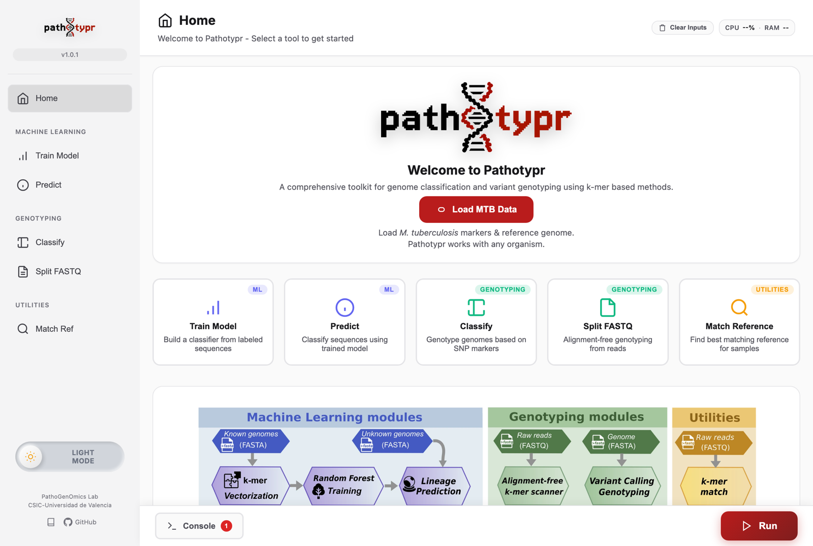
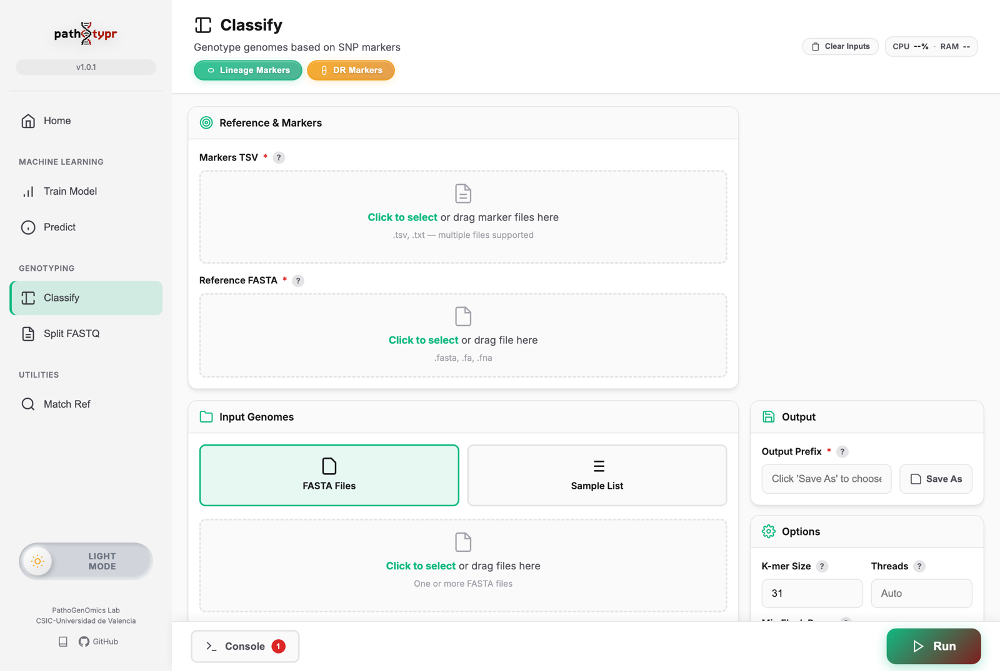
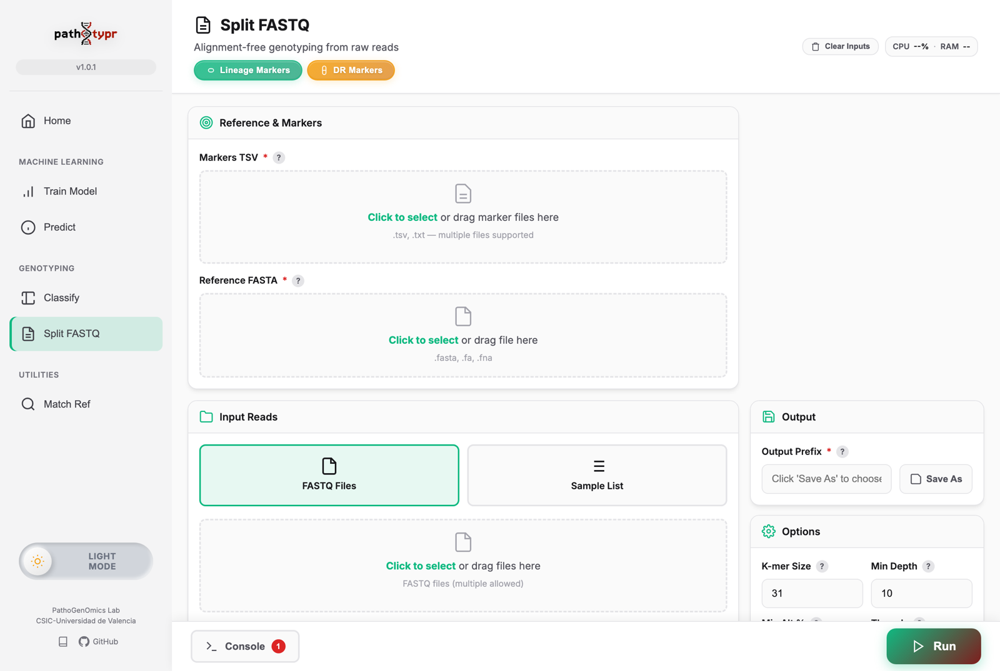

# Desktop GUI

pathotypr includes a native desktop application built with [Tauri](https://tauri.app/). It wraps the same `pathotypr-core` engine as the CLI, so every workflow produces identical results — just with drag-and-drop, live progress, and interactive tables.

## Get the app

**Download a ready-built installer — you do not need to compile anything.**
Installers for macOS, Linux and Windows are published with every release:

[:material-download: **Download the latest release**](https://github.com/PathoGenOmics-Lab/pathotypr/releases/latest){ .md-button .md-button--primary }

| Platform | File |
|---|---|
| :material-apple: macOS (Apple Silicon) | `Pathotypr_<version>_aarch64.dmg` |
| :material-apple: macOS (Intel) | `Pathotypr_<version>_x64.dmg` |
| :material-linux: Linux | `.deb`, `.rpm` or `.AppImage` |
| :material-microsoft-windows: Windows | `Pathotypr_<version>_x64-setup.exe` |

See [Installation](installation.md) for every bundle, and for the first-launch
note on macOS and Windows.

!!! info "Building is only for developers"
    Everything below describes building the app from source. You only need it if
    you are modifying pathotypr itself — to *use* the app, download an installer
    above.

## Features

- All five workflows: [train](train.md), [predict](predict.md), [classify](classify.md), [split-fastq](split-fastq.md), [match](match.md)
- Drag-and-drop file selection
- Interactive result tables with sorting and filtering
- Real-time progress bars with cancellation support
- Training summary card (accuracy, OOB, CV metrics, model size)
- Genotyping views: resistance matrix, lineage composition, depth-vs-allele-fraction scatter
- Live CPU/RAM usage indicator
- Light and dark themes
- Excel export written alongside the TSV output
- Configurable parameters with sensible defaults and reset buttons

## Using the app

Every workflow uses the same window. The sidebar picks one of the five commands,
grouped as machine learning, genotyping and utilities; the form in the middle collects
exactly what the corresponding command takes as flags; and the run button, the progress
bar and the console sit along the bottom.



### Getting the reference data

**Load MTB Data** downloads the marker panels, the pre-trained model and the MTBC
ancestor reference, and fills them into every panel that needs them. It resolves the
newest published version of the [Zenodo deposit](https://doi.org/10.5281/zenodo.19210043)
at download time, so the app keeps working when the catalogue is updated. The Classify
and Split FASTQ panels also have **Lineage Markers** and **DR Markers** buttons that
fetch one panel at a time.

If you already have the files — from [Getting started](getting-started.md), for
instance — drag them onto the fields instead. The app never needs the files to come
from Zenodo.

### Genotyping an assembly



1. Drop the marker TSV on **Markers TSV** and the ancestor genome on **Reference FASTA**.
   Both are filled for you if you used one of the download buttons.
2. Drop your assemblies on **Input Genomes**, or switch to **Sample List** to pass a file
   listing them.
3. Set **Output Prefix** with *Save As*.
4. Adjust **Options** if you need to; the defaults match the CLI defaults.
5. Press **Run**.

Files are routed to the field you drop them on, and the field under the cursor is
highlighted while you drag. Dropping on empty space routes by extension instead, and
when an extension fits more than one field — `.fasta` fits both the reference and the
samples — the app says so and leaves the file for you to place, rather than guessing.

### Genotyping reads



Same shape, with FASTQ input. Paired files are detected from their names (`_R1`/`_R2`,
`_1`/`_2`, `.1`/`.2`), and **Min Depth** and **Min Alt Percent** are the read-level
thresholds described in [split-fastq](split-fastq.md).

### Reading the results

When a run finishes the results open below the form: a paginated, filterable table of
the output TSV, and charts appropriate to the workflow — lineage composition, a
resistance profile for a drug-resistance panel, or match scores. The console drawer
keeps a timestamped log, and output paths in it are clickable.

The files themselves are written exactly where the CLI would write them, with the same
names, and an `.xlsx` copy alongside if you tick the Excel option.

### The same run on the command line

Every field is one flag. The GUI is a front end to the same engine, so a run set up in
the app is a run you can script:

| Field in the app | Flag |
|---|---|
| Markers TSV | `-m, --markers` |
| Reference FASTA | `-r, --reference` |
| Input Genomes / FASTQ files | `-i, --input` |
| Sample List | `-l, --input-list` |
| Output Prefix | `-o, --output-prefix` |
| K-mer Size | `-k, --kmer-size` |
| Threads | `-t, --threads` |
| Min Depth | `--min-depth` |
| Min Alt Percent | `--min-alt-percent` |
| Nested classification | `--nested-classification` |
| Excel output | `--excel` |

!!! tip "Use the CLI for anything repeated"
    The app is built for looking at one run closely: setting it up, watching it, and
    reading the tables and charts it produces. Batches, cluster jobs, pipelines and
    anything you need to reproduce months later belong on the command line, which is
    documented per command under [Commands](train.md) and is the reference
    implementation. Both call the same `pathotypr-core`, so results are identical.


## Building from source

*Only needed to modify pathotypr itself — see [Get the app](#get-the-app) to
just use it.*

### Prerequisites

1. **Rust** — a recent stable toolchain (install via [rustup](https://rustup.rs/)).
2. **Tauri CLI v2**:

    ```bash
    cargo install tauri-cli --version "^2"
    ```

    !!! warning "Must be the 2.x CLI"
        pathotypr targets **Tauri 2**. A `tauri-cli` from the 1.x series already
        on your `PATH` will fail to build this project. Confirm your version
        with `cargo tauri --version` before continuing.

3. **System dependencies** — these vary by platform:

    === ":material-linux: Linux (Debian/Ubuntu)"

        ```bash
        sudo apt install libgtk-3-dev libwebkit2gtk-4.1-dev libjavascriptcoregtk-4.1-dev
        ```

        !!! note "These are the 4.1 packages"
            Tauri 2 links against the **4.1** WebKitGTK / JavaScriptCore
            packages. The older `4.0` variants (all that some distributions,
            e.g. Ubuntu 20.04, ship by default) will **not** work — use a newer
            release or a backport that provides the `4.1` packages.

    === ":material-apple: macOS"

        The Xcode Command Line Tools are usually pre-installed. If they are
        missing, install them with:

        ```bash
        xcode-select --install
        ```

    === ":material-microsoft-windows: Windows"

        The **WebView2 runtime** is required. It is pre-installed on Windows 11
        and most up-to-date Windows 10 machines. If it is missing, install the
        Evergreen runtime from
        [Microsoft](https://developer.microsoft.com/en-us/microsoft-edge/webview2/).

### Development

```bash
cargo tauri dev
```

Opens the app in development mode. The frontend is plain static files with no dev server, so front-end edits need a webview reload rather than arriving by hot reload.

!!! note "First build is slow"
    The initial `cargo tauri dev` compiles the full Rust dependency tree and can
    take several minutes. Subsequent runs are incremental and start quickly.

### Production build

```bash
cargo tauri build
```

With `targets: "all"` (set in `tauri.conf.json`), this produces distributable
installers under `target/release/bundle/` (the workspace-root `target/`, not `src-tauri/target/`):

- **macOS**: `.dmg` in `bundle/dmg/` (and the `.app` in `bundle/macos/`)
- **Linux**: `.deb` in `bundle/deb/`, `.rpm` in `bundle/rpm/`, and `.AppImage` in `bundle/appimage/`
- **Windows**: `.msi` in `bundle/msi/` and the NSIS `.exe` in `bundle/nsis/`

!!! warning "Builds are unsigned"
    Neither the published installers nor binaries you build yourself are signed
    with a paid developer certificate, so macOS Gatekeeper and Windows
    SmartScreen will warn you the first time you open them. See the
    [first-launch notes](installation.md#desktop-gui-pre-built) on the
    Installation page for how to get past the warning.

## Architecture

```text
src-tauri/
├── src/
│   ├── main.rs       # Tauri app setup
│   ├── commands.rs   # Tauri command handlers (bridge GUI → core)
│   ├── state.rs      # Task state, cancellation + progress events
│   └── util.rs       # Path validation, SSRF guard, system usage
├── Cargo.toml
└── tauri.conf.json

frontend/
├── index.html        # Main page layout (loads js/main.js as a module)
├── styles.css        # Styling
└── js/
    ├── main.js       # Initialization
    ├── forms.js      # Form submission handlers
    ├── results.js    # Result table rendering
    ├── visualization.js  # Charts + summary cards
    ├── progress.js   # Progress bars + cancellation
    ├── config.js     # Default parameters
    ├── state.js      # Run state management
    ├── navigation.js # Tab navigation
    ├── dropzone.js   # Drag-and-drop file handling
    ├── console.js    # Log console drawer
    ├── tauri.js      # Tauri API wrappers
    ├── theme.js      # Light/dark theme toggle
    ├── utils.js      # Shared utilities
    ├── dr-insights.js      # Resistance profile, lineage levels, allele fractions
    └── genotype-charts.js  # Resistance matrix, lineage composition, QC scatter
```

## How it works

1. Frontend collects form parameters and sends them to Tauri via `invoke()`
2. `commands.rs` deserializes parameters and calls `pathotypr_core` functions
3. Core library runs the workflow while `commands.rs` emits progress events back to the frontend
4. Results are displayed in interactive tables and summary cards
5. Cancellation token allows stopping any running workflow via the UI

## See also

- [Installation](installation.md) — pre-built desktop installers for macOS, Linux, and Windows
- [Input formats](input-formats.md) — accepted assemblies, reads, and marker files
- Command references: [train](train.md) · [predict](predict.md) · [classify](classify.md) · [split-fastq](split-fastq.md) · [match](match.md)
