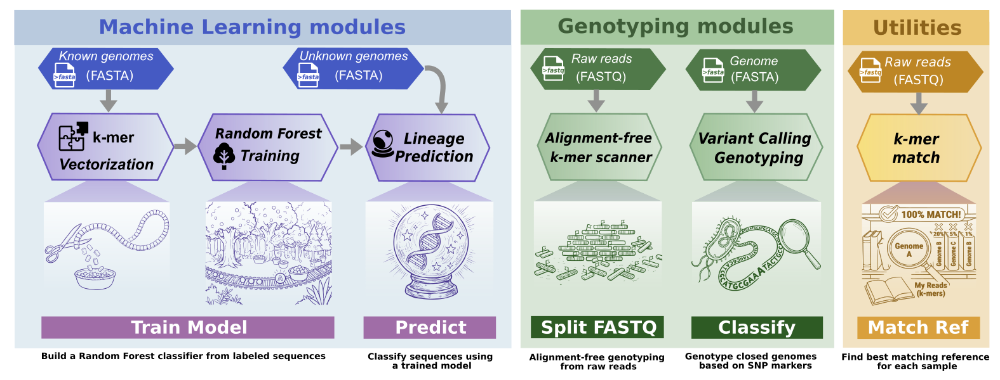

<p align="center">
  
</p>

<div align="center">

[](https://pathogenomics-lab.github.io/pathotypr/)
[](LICENSE)
[](https://anaconda.org/bioconda/pathotypr)
[](https://anaconda.org/bioconda/pathotypr)
[](https://doi.org/10.64898/2026.03.24.714002)
[](https://doi.org/10.5281/zenodo.19210043)

**Lineage classification and marker-driven genotyping — from assemblies or raw reads.**

### 📖 [**Read the documentation**](https://pathogenomics-lab.github.io/pathotypr/)

Tutorials, every command option, input formats, output columns and benchmarks.

</div>

__Paula Ruiz-Rodriguez<sup>1</sup>__
__and Mireia Coscolla<sup>1</sup>__
<br>
<sub> 1. Institute for Integrative Systems Biology, I<sup>2</sup>SysBio, University of Valencia-CSIC, Valencia, Spain </sub>

---

## What is pathotypr?

pathotypr is a Rust toolkit that classifies microbial genomes into lineages and genotypes them against user-defined marker panels. It works with both assembled genomes (FASTA) and raw sequencing reads (FASTQ), runs on a single laptop, and ships with a native desktop GUI.

<p align="center">
  <picture>
    <source media="(prefers-color-scheme: dark)" srcset="docs/assets/scheme-dark.webp">
    <source media="(prefers-color-scheme: light)" srcset="docs/assets/scheme.svg">
    
  </picture>
</p>

| Command | What it does | Input | Guide |
|---|---|---|---|
| **`train`** | Build a Random Forest classifier from labeled genomes | FASTA | [docs](https://pathogenomics-lab.github.io/pathotypr/train/) |
| **`predict`** | Assign lineages using a trained model | FASTA + model | [docs](https://pathogenomics-lab.github.io/pathotypr/predict/) |
| **`classify`** | Call known SNP markers in assemblies | FASTA + markers | [docs](https://pathogenomics-lab.github.io/pathotypr/classify/) |
| **`split-fastq`** | Alignment-free genotyping from reads | FASTQ + markers | [docs](https://pathogenomics-lab.github.io/pathotypr/split-fastq/) |
| **`match`** | Find the closest reference genome | FASTQ + references | [docs](https://pathogenomics-lab.github.io/pathotypr/match/) |

> [!NOTE]
> Nothing is hard-coded to one organism: the marker panel you supply defines what is typed. In practice pathotypr has only been validated on the *M. tuberculosis* complex, so treat other organisms as exploratory and check them against a truth set you trust.

## Install

**Command line**

```bash
conda create -n pathotypr -c bioconda pathotypr
conda activate pathotypr
pathotypr --help
```

**Desktop app**: [download an installer](https://github.com/PathoGenOmics-Lab/pathotypr/releases/latest) for macOS, Linux or Windows. No compiler needed.

Building from source, system dependencies and the first-launch notes for unsigned apps are in the [installation guide](https://pathogenomics-lab.github.io/pathotypr/installation/).

## Quick start

```bash
# Genotype an assembly against a marker panel
pathotypr classify -m markers.tsv -r reference.fasta -i sample.fasta -o results

# Genotype straight from reads
pathotypr split-fastq -m markers.tsv -r reference.fasta \
  -i reads_R1.fastq.gz -i reads_R2.fastq.gz -o genotype

# Train a model, then apply it
pathotypr train   -i labeled_genomes.fasta -o model.pathotypr.zst
pathotypr predict -i query.fasta -m model.pathotypr.zst -o predictions.tsv
```

Add `--excel` to any command to also write `.xlsx`. The
[getting started tutorial](https://pathogenomics-lab.github.io/pathotypr/getting-started/)
walks through a full MTBC run, from install to reading the output.

## Ready-to-use MTBC data

Marker panels and a pre-trained model for the *M. tuberculosis* complex are published on Zenodo under the concept DOI [10.5281/zenodo.19210043](https://doi.org/10.5281/zenodo.19210043), which always resolves to the newest version:

| File | Contents |
|---|---|
| `pathotypr_lineage_markers_*.tsv` | 3,707 lineage SNPs (L1–L10, A1–A4) |
| `pathotypr_dr_markers_ancestor_*.tsv` | DR mutations from the WHO catalogue (2nd edition, 2023), ancestor coordinates |
| `pathotypr_dr_markers_H37Rv_*.tsv` | The same catalogue in H37Rv coordinates |
| `pathotypr_rf_model_*.pathotypr` | Pre-trained Random Forest (k=31, 100 trees) |

Download links and usage are in the [installation guide](https://pathogenomics-lab.github.io/pathotypr/installation/#mtbc-marker-files-pre-trained-model).

## Documentation

Everything lives at **[pathogenomics-lab.github.io/pathotypr](https://pathogenomics-lab.github.io/pathotypr/)**:

| | |
|---|---|
| [Getting started](https://pathogenomics-lab.github.io/pathotypr/getting-started/) | End-to-end MTBC tutorial |
| [Input formats](https://pathogenomics-lab.github.io/pathotypr/input-formats/) | What every file must look like, per command |
| [Marker format](https://pathogenomics-lab.github.io/pathotypr/marker_format/) | Curating your own panel |
| [Output files](https://pathogenomics-lab.github.io/pathotypr/output-files/) | Every column of every file |
| [Desktop GUI](https://pathogenomics-lab.github.io/pathotypr/gui/) | The app, and building it |
| [Algorithms](https://pathogenomics-lab.github.io/pathotypr/algorithms/) | How each module works |
| [Benchmarks](https://pathogenomics-lab.github.io/pathotypr/benchmarks/) | Speed, memory and tool comparison |
| [FAQ](https://pathogenomics-lab.github.io/pathotypr/faq/) | Common problems |

## Citation

If you use pathotypr, please cite:

> Ruiz-Rodriguez P, Coscollá M. **Pathotypr: harmonised MTBC lineage assignment and resistance-associated variant detection for genomic surveillance.** *bioRxiv* (2026). doi: [10.64898/2026.03.24.714002](https://doi.org/10.64898/2026.03.24.714002)

BibTeX, RIS and APA entries, plus the software DOI, are on the
[citation page](https://pathogenomics-lab.github.io/pathotypr/citation/).

## License

[GNU Affero General Public License v3.0](LICENSE)

---
<h2 id="contributors" align="center">

✨ [Contributors](https://github.com/PathoGenOmics-Lab/pathotypr/graphs/contributors)
</h2>

<!-- ALL-CONTRIBUTORS-LIST:START - Do not remove or modify this section -->
<!-- prettier-ignore-start -->
<!-- markdownlint-disable -->
<div align="center">
pathotypr is developed with ❤️ by:
<table>
  <tr>
    <td align="center">
      <a href="https://github.com/paururo">
        
        <br />
        <sub><b>Paula Ruiz-Rodriguez</b></sub>
      </a>
      <br />
      <a href="" title="Code">💻</a>
      <a href="" title="Research">🔬</a>
      <a href="" title="Ideas">🤔</a>
      <a href="" title="Data">🔣</a>
      <a href="" title="Desing">🎨</a>
      <a href="" title="Tool">🔧</a>
    </td>
    <td align="center">
      <a href="https://github.com/mireiacoscolla">
        
        <br />
        <sub><b>Mireia Coscolla</b></sub>
      </a>
      <br />
      <a href="https://www.uv.es/instituto-biologia-integrativa-sistemas-i2sysbio/es/investigacion/proyectos/proyectos-actuales/mol-tb-host-1286169137294/ProjecteInves.html?id=1286289780236" title="Funding/Grant Finders">🔍</a>
      <a href="" title="Ideas">🤔</a>
      <a href="" title="Mentoring">🧑‍🏫</a>
      <a href="" title="Research">🔬</a>
      <a href="" title="User Testing">📓</a>
    </td>
  </tr>
</table>

This project follows the [all-contributors](https://github.com/all-contributors/all-contributors) specification ([emoji key](https://allcontributors.org/docs/en/emoji-key)).

<!-- markdownlint-restore -->
<!-- prettier-ignore-end -->

<!-- ALL-CONTRIBUTORS-LIST:END -->
